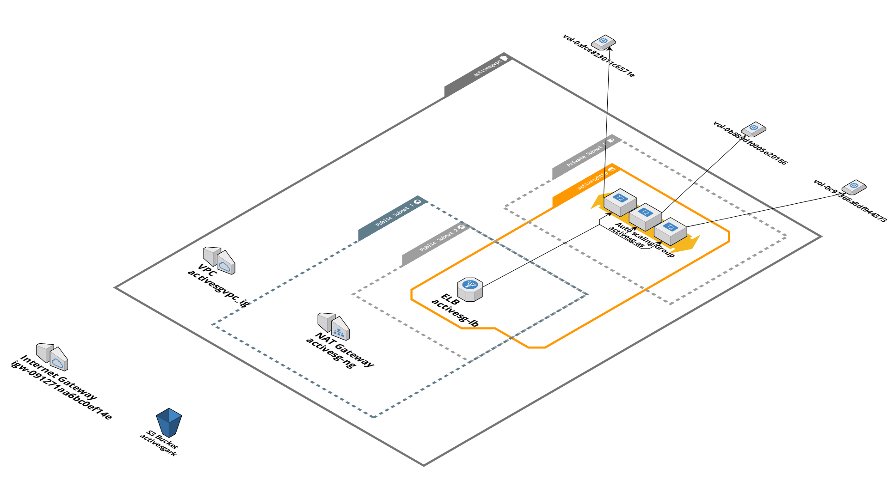

# aws-instance-refresh
Prvision aws infrastructure with Terrafrom and trigger instance refresh

## Prerequisites 
- Install Terraform
- S3 bucket (activesgark) (Upload Incremental Decremental html)
- AWS credentials with AmazonEC2FullAccess and Amazons3FullAccess
- Add Aws credentials, Auto scaling group name variables in GitLab Project→Settings→CICD–Variables

## Setup AWS credentials locally

Following command allows you to setup aws credetial locally.

```
aws configure
```

## Download Code

```
git clone https://github.com/kroshantha/aws-instance-refresh.git
cd aws-instance-refresh
terraform init
terraform plan
terraform apply -auto-approve
```
---

## VPC:

